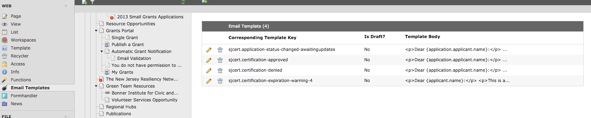
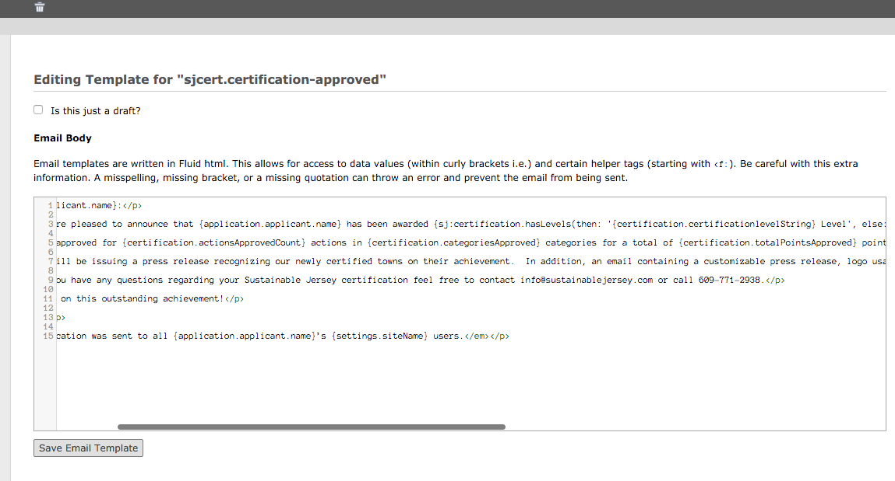

## `EmailService`

In a lot of web applications, there are many places where emails are sent from. However, if you stick with sending _all_ emails through the same service, you can quickly make changes, track sent emails, whitelist email addresses, and add new templates without running into too many issues. That's what this `EmailService` class is for. 

#### Registering Templates

First, of all, templates are "registered" in typoscript. 

```
plugin.tx_myext.settings.email {
  templates {
    some-template {
      subject = Here is an email for you
      templateFile = Email/SomeTemplate.html

      # optional
      sender {
        name = Some Person
        email = some@person.com
      }
      
      # Prevent BE editors from ovirrding this template
      # optional 
      noOverride = 1
    }
  }
  
  # optional, if not provided here or in the template config, then uses:
  #   $TYPO3_CONF_VARS['mail']['defaultMailFromAddress']
  #   $TYPO3_CONF_VARS['mail']['defaultMailFromName']
  defaultSender {
    name = Wobsite Info
    email = info@wobsite.com
  }
}
```

Using `EmailService`, no email goes out that isn't registered with all the necessary configuration. 

> This may seem like an inconvenient step, but the idea is that it allows you to specify a template without needing to know or hardcode the actual file name. That way, you may freely change the file name without worrying about breaking anything everywhere that you've specified that template in the code. 

#### Sending Email

```
 // Create a basic email
 $msg = $this->emailService->createMessage(
   'some-template',                             # template identifier
   array('email@test.com' => 'Email Test'),     # recipient
   array('someVar' => $someDataForTemplate)     # variables available in fluid template
 );
 
 // Add an attachment
 $attachment = $this->emailService->createAttachment('some/path.jpg', 'image/jpeg');
 $msg->attach($attachment);
 
 // Send the message
 $msg->send();
```

#### Whitelists

In local development environments, it's important to be able to reproduce sending emails to users, but you don't _actually_ want the email to go to the user. The solution is to set up a whitelist (locally) that only permits some emails to go out. 

```
plugin.tx_myext.settings.email {
  
  # only these people will get emails
  whitelist = teaching.bites@springfield.edu : Edna Krabappel , school.rocks@springfield.edu : Lisa Simpson
  
  # if true, _all_ emails are sent to the whitelisted addresses
  # if false, _only_ emails specifically sent to those addresses are sent  
  alwaysOverrideWithWhitelist = 1
}
```

#### Email Overrides

Email overrides are probably the coolest feature. If enabled, you can allow your clients to directly override the templates sent out. They do this through a backend module. The overrides are stored as domain records and pulled in when the email is sent out.

> It's risky allowing clients to edit fluid templates, but totally handy.




[back to docs](.)